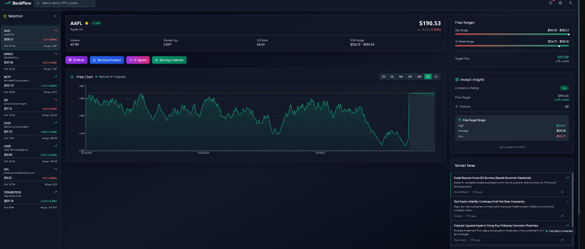

# 📊 StockFlow – Real-Time Stock Market Dashboard

[](LICENSE)


**StockFlow** is a modern, responsive, and real-time stock market analysis dashboard built for traders, investors, and market enthusiasts.  
It delivers **live market data**, **beautiful charts**, and **actionable insights** in a sleek dark-mode interface.

---

## 🚀 Features

- **🔍 Live Watchlist** – Track multiple companies with live price, % change, volume, and market cap.
- **📈 Interactive Price Charts** – Historical & projected trends with multiple timeframes (1D, 5D, 1M, 3M, 6M, 1Y, 5Y).
- **💹 Detailed Stock Overview** – Market cap, P/E ratio, day range & 52-week range.
- **📊 Analyst Insights** – Consensus ratings, price targets, upside potential.
- **🌎 Global & Local Coverage** – US markets + Indian majors (incl. Tata Group).
- **🔄 Real-Time Updates** – WebSocket/polling from live market APIs.

### ✨ New Modules
- **💼 Portfolio** – Add holdings, track current value, daily/total P&L, allocation charts, and time-series performance.
- **📐 Technical Analysis** – Toggle RSI, MACD, SMA/EMA, Bollinger Bands, VWAP; crossovers & overbought/oversold highlights.
- **🤖 AI Signals** – Rule-based + ML signals (“Buy/Sell/Hold”) using indicator ensembles; optional LLM notes on momentum & risk.
- **🗓 Earnings Calendar** – Upcoming earnings, previous surprise, estimate vs actual, with chart markers on earnings dates.

---

## 🖼 Preview



> Tip: add more screenshots like `assets/Dashboard 2.png`, `assets/Dashboard 3.png`, `assets/Dashboard 4.png`, `assets/Dashboard 5.png`, `assets/Dashboard 6.png` to showcase the new modules.

---

## 🛠 Tech Stack

**Frontend**
- React (Vite / Next.js)
- Tailwind CSS
- Recharts / D3.js
- Framer Motion

**Backend**
- Node.js + Express (or Python FastAPI alternative)
- WebSocket for real-time streams
- Optional cache (Redis/Memory) to respect API rate limits

**Data Sources**
- Yahoo Finance API
- Alpha Vantage / Finnhub / Polygon.io (configurable)

**Optional (for AI Signals)**
- Scikit-learn or TensorFlow (classic models)
- OpenAI/HuggingFace (LLM notes) – optional

---

## 📦 Installation

```bash
# 1️⃣ Clone repository
git clone https://github.com/yourusername/stockflow.git
cd stockflow

# 2️⃣ Install dependencies
npm install

# 3️⃣ Create .env (frontend) – example:
# (If using Vite, prefix with VITE_)
VITE_API_PROVIDER=yahoo            # yahoo | alpha | finnhub | polygon
VITE_API_URL=https://api.example.com
VITE_API_KEY=your_api_key_here

# Optional for AI Signals (only if you enable LLM notes)
VITE_OPENAI_API_KEY=your_openai_key

# 4️⃣ Run development server
npm run dev
The app will be available at http://localhost:3000.

⚙️ Configuration
src/config/api.ts|js

ts
Copy
Edit
export const config = {
  provider: import.meta.env.VITE_API_PROVIDER ?? 'yahoo',
  baseUrl: import.meta.env.VITE_API_URL,
  apiKey: import.meta.env.VITE_API_KEY,
};
src/config/features.ts|js

ts
Copy
Edit
export const features = {
  portfolio: true,
  technicalAnalysis: true,
  aiSignals: true,
  earningsCalendar: true,
};
📚 API Integration
StockFlow supports multiple providers (choose via .env):

Yahoo Finance

Alpha Vantage

Finnhub

Polygon.io

Remember to set rate limits and caching in the backend (/server) to avoid throttling.

🧩 Key Modules (How They Work)
Portfolio

Persist holdings (localStorage or user account).

Calculates current value, daily/total P&L, CAGR, Sharpe (optional).

Visuals: allocation donut, P&L timeline, winners/losers.

Technical Analysis

Indicators: RSI, MACD, SMA/EMA (configurable periods), Bollinger Bands, VWAP.

Overlay toggles + tooltips with values.

Signal highlights: crossovers, RSI > 70 / < 30, band breaks.

AI Signals

Deterministic rules (indicator ensemble) → signal.

Optional ML: train/test on historical OHLCV (walk-forward).

Optional LLM note: concise plain-English rationale.

Earnings Calendar

Pull upcoming dates + estimates, previous results & surprise.

Chart markers on earnings candles; click to open earnings card.

🗂 Suggested Structure
lua
Copy
Edit
stockflow/
├─ src/
│  ├─ components/
│  │  ├─ Chart/
│  │  ├─ Watchlist/
│  │  ├─ Portfolio/
│  │  ├─ TechnicalIndicators/
│  │  ├─ AnalystInsights/
│  │  └─ Earnings/
│  ├─ pages/
│  │  ├─ Dashboard.tsx
│  │  ├─ Portfolio.tsx
│  │  └─ Settings.tsx
│  ├─ hooks/
│  ├─ lib/ (api clients, cache, math, ta)
│  └─ config/
└─ server/ (Express API proxy & cache)
🧪 Scripts
bash
Copy
Edit
npm run dev        # start dev server
npm run build      # production build
npm run preview    # preview production build
npm run lint       # lint code
🧭 Roadmap
 Portfolio

 Technical Analysis overlays

 AI Signals (rules + optional ML/LLM notes)

 Earnings Calendar

 News sentiment scoring & heatmaps

 Multi-watchlists + alerting (email/push/SMS)

 Crypto, ETFs & indices in one view

 Backtesting module for strategies

🤝 Contributing
Fork the repo

Create a feature branch:

bash
Copy
Edit
git checkout -b feature/new-feature
Commit your changes:

bash
Copy
Edit
git commit -m "feat: add <your feature>"
Push the branch:

bash
Copy
Edit
git push origin feature/new-feature
Open a Pull Request

📜 License
This project is licensed under the MIT License. See LICENSE for details.

🙏 Acknowledgements
Inspired by modern finance platforms (TradingView, MSN Finance, Yahoo Finance).
Data provided by Yahoo/Alpha Vantage/Finnhub/Polygon.io under their respective terms.
